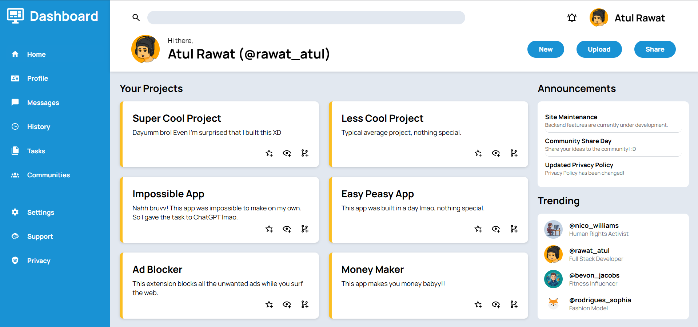

# Admin Dashboard

A responsive admin dashboard built as part of The Odin Project.

## Preview

## Features

- CSS Grid layout
- Flexbox components
- Sidebar navigation
- Dashboard cards
- Announcements section
- Trending section
- Responsive layout
- Hover animations
- Transitions

## Built With

- HTML5
- CSS3
- CSS Grid
- Flexbox

## Live Demo

https://atulrawat4903.github.io/admin-dashboard/

## What I Learned

- Combining CSS Grid and Flexbox
- Building complex dashboard layouts
- Creating responsive interfaces
- Using SVG icons
- Organizing large CSS files

## Credits

- Icons: Material Design Icons
- Font: Manrope
- Project: The Odin Project